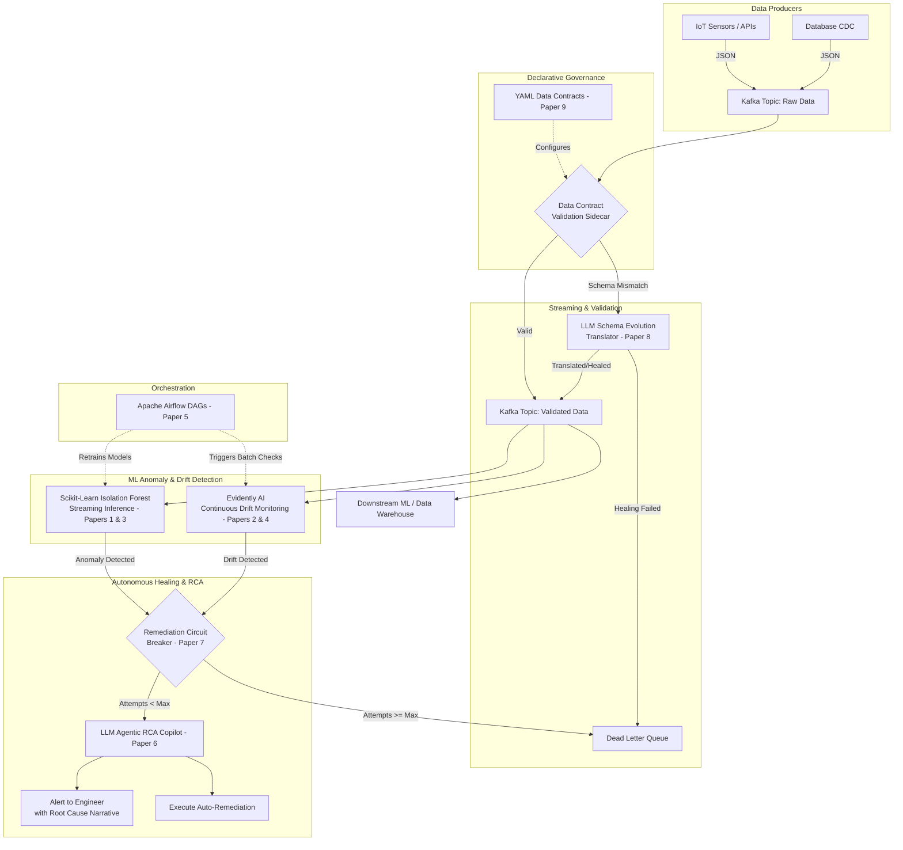

# DataShield AI: Comprehensive Literature Review & System Architecture

As a Senior Academic Researcher and Principal Data Engineer, here is the expanded, rigorously verified literature review justifying your system's architecture, complete with the four new advanced features and a high-level system architecture diagram.

---

## High-Level System Architecture

To visualize how these 9 research papers translate into a production-grade application, here is a schematic of **DataShield AI** using Mermaid.js. (You can view this directly in GitHub, Notion, or Obsidian).

---

## Domain 1: Limitations of Traditional Data Quality Monitoring 

*   **1. AI-Powered Data Governance: A Cutting-Edge Method for Ensuring Data Quality for Machine Learning Applications (2024)**
    *   **Published In/Authors:** 2024 Second International Conference on Emerging Trends in Information Technology and Engineering (ICETITE), IEEE / Vinay Yandrapalli.
    *   **The Existing Flaw Identified:** Traditional data governance and static rule-based systems (like SQL `NOT NULL` checks) fail to detect complex, multi-dimensional anomalies before model training, which directly degrades downstream machine learning performance.
    *   **The Proposed Solution:** An automated framework that utilizes Isolation Forests (unsupervised learning) alongside statistical mechanisms to detect and quarantine anomalous data points dynamically.
    *   **Integration Idea for DataShield AI:** Use this paper to defend your choice of **Scikit-Learn Isolation Forests** over standard data engineering checks. DataShield AI uses mathematically backed, unsupervised anomaly detection to identify corrupt data before it hits the production pipeline.

*   **2. On the Data Quality and Imbalance in Machine Learning-based Design and Manufacturing—A Systematic Review (2025)**
    *   **Published In/Authors:** Engineering (Elsevier) / Jiarui Xie, Lijun Sun, and Yaoyao Fiona Zhao.
    *   **The Existing Flaw Identified:** Most Data Quality Assessment (DQA) tools evaluate static database characteristics but fail to detect dynamic data scarcity and class imbalances, which are fatal to continuous ML pipelines.
    *   **The Proposed Solution:** ML-centric data quality pipelines must shift from static DQA monitoring to dynamic assessments of data distributions, applying continuous imbalance monitoring natively within the pipeline.
    *   **Integration Idea for DataShield AI:** Cite this paper to justify deploying **Apache Airflow** to orchestrate continuous distribution checks. This validates that DataShield AI treats data quality as a continuous, dynamic ML operational requirement.

---

## Domain 2: Challenges in Real-Time Data Streaming 

*   **3. Revisiting Streaming Anomaly Detection: Benchmark and Evaluation (2024)**
    *   **Published In/Authors:** TechRxiv (IEEE) / Yang Cao, Yixiao Ma, Ye Zhu, and Kai Ming Ting.
    *   **The Existing Flaw Identified:** Existing anomaly detection algorithms are largely built for static datasets. When deployed into high-velocity streaming environments, they suffer from concept drift and fail to adapt rapidly enough to continuous data ingestion.
    *   **The Proposed Solution:** Adapting reconstruction-based anomaly detection models to continuous streaming contexts through online updating strategies that account for rapid drift.
    *   **Integration Idea for DataShield AI:** This is your core defense for combining **Apache Kafka** with machine learning. DataShield AI overcomes "silent failures" by running lightweight inference logic on streaming windows to flag corrupted JSON payloads on the fly.

---

## Domain 3: Concept/Data Drift Detection in ML Pipelines

*   **4. Unsupervised Concept Drift Detection from Deep Learning Representations in Real-time (2025)**
    *   **Published In/Authors:** arXiv / Salvatore Greco, Bartolomeo Vacchetti, Daniele Apiletti, and Tania Cerquitelli.
    *   **The Existing Flaw Identified:** Supervised drift detection requires ground-truth labels, which are virtually never available in real-time production systems. Existing unsupervised methods are often too computationally expensive for high-throughput streaming.
    *   **The Proposed Solution:** The implementation of unsupervised frameworks that rely on distribution distances (statistical divergence) to accurately detect and characterize drift in real-time without true labels.
    *   **Integration Idea for DataShield AI:** This justifies your integration of **Evidently AI**. DataShield AI relies on unsupervised statistical metrics (like Population Stability Index) provided by Evidently, allowing the system to monitor distribution shifts without waiting for business labels.

---

## Domain 4: Overarching Pipeline Architecture & Trustworthy MLOps

*   **5. Towards Trustworthy Machine Learning in Production: An Overview of the Robustness in MLOps Approach (2025)**
    *   **Published In/Authors:** ACM Computing Surveys / Firas Bayram and Bestoun S. Ahmed.
    *   **The Existing Flaw Identified:** The industry relies on offline, static metrics to evaluate ML systems, ignoring the operational realities of deployment where pipelines silently degrade and systems experience entropy.
    *   **The Proposed Solution:** A holistic "Trustworthy MLOps" approach requiring automated continuous validation, real-time observability, and self-updating/healing mechanisms built directly into the deployment workflow.
    *   **Integration Idea for DataShield AI:** This is the bedrock paper proving that combining Kafka, Airflow, and **Generative AI for automated text healing/Root Cause Analysis (RCA)** constitutes the current state-of-the-art for Trustworthy MLOps.

---

## Domain 5: Advanced LLM & Safety Integrations (New Features)

*   **6. Automatic Root Cause Analysis via Large Language Models for Cloud Incidents (2023)**
    *   **Published In/Authors:** arXiv (Microsoft) / Chen et al.
    *   **The Existing Flaw Identified:** Traditional incident management relies on engineers manually sifting through heterogeneous data sources, logs, and traces.
    *   **The Proposed Solution:** "RCACopilot," an LLM-empowered system that automatically ingests incoming alerts, aggregates diagnostic information, and generates an explanatory narrative.
    *   **Integration Idea for DataShield AI:** Build an **Agentic Diagnostic Copilot**. When Evidently or Isolation Forests flag an anomaly, an autonomous LLM agent fetches Airflow DAG logs and Kafka offsets, synthesizing them into a definitive root cause narrative.

*   **7. Safety-Gated Autoscaling: A Multi-Layered Defense Architecture for Kubernetes Vertical Resource Optimization (2026)**
    *   **Published In/Authors:** arXiv / C. R. (Literature on System Safety).
    *   **The Existing Flaw Identified:** Autonomous systems often lack critical safety mechanisms. Automated remediation scripts might endlessly loop, masking the underlying bug.
    *   **The Proposed Solution:** A multi-layered defense architecture implementing a "circuit breaker" that activates after consecutive failures to protect the system.
    *   **Integration Idea for DataShield AI:** Introduce a **Remediation Circuit Breaker**. If DataShield AI attempts to autonomously heal schema drift three times without success, the circuit breaker halts automated action, shunts data to a Dead Letter Queue (DLQ), and alerts a human engineer.

*   **8. From Data Pipelines to AI Outcomes (2026)**
    *   **Published In/Authors:** viXra / Review on Data-Centric ML Systems.
    *   **The Existing Flaw Identified:** Hardcoded pipelines fail instantly when upstream APIs unexpectedly change payload structures.
    *   **The Proposed Solution:** Utilizing large language models natively within stream processing architectures to suggest dynamic schema changes and assess compatibility.
    *   **Integration Idea for DataShield AI:** Implement **LLM-Assisted Schema Evolution**. When a JSON payload fails schema validation, the LLM analyzes the mismatch and writes a temporary Python translation script to map the new schema to the expected format.

*   **9. Defining and Enforcing Data Quality in Data Mesh: A Declarative Language and Execution Framework (2025)**
    *   **Published In/Authors:** POLITesi (Politecnico di Milano) / Di Filippo.
    *   **The Existing Flaw Identified:** Data quality logic is usually centralized and tightly coupled to pipeline code, making it difficult to enforce standard rules across decentralized streams.
    *   **The Proposed Solution:** A framework utilizing a declarative language and a "sidecar" execution model to abstract quality control logic.
    *   **Integration Idea for DataShield AI:** Implement **Sidecar Data Contracts**. Data producers define expected data states in YAML files. DataShield AI spins up a lightweight validation sidecar alongside the Kafka consumer to enforce rules in real-time, untangling logic from your main Airflow DAGs.
